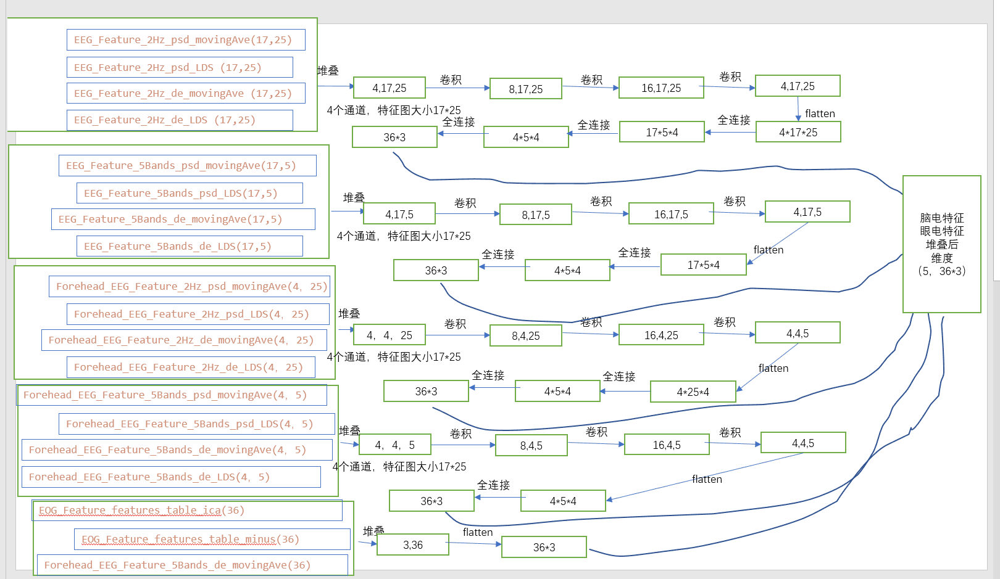
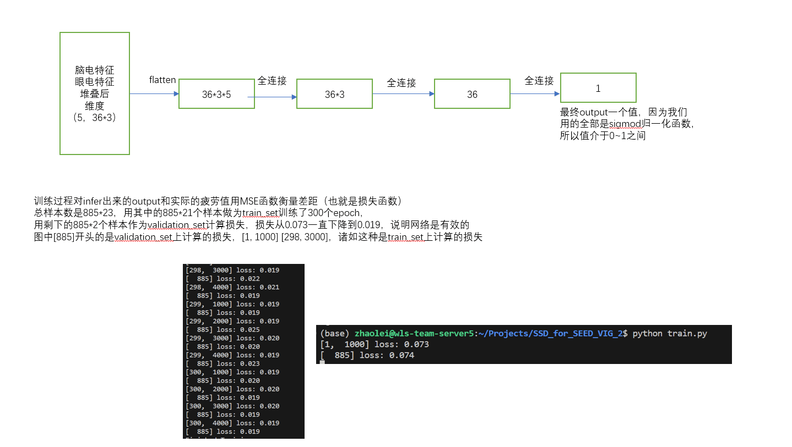

# SEED-VIG-CNN

基于上海交通大学 SEED-VIG 数据集的驾驶警觉度回归模型。模型融合头皮 EEG、前额 EEG 和 EOG 特征，预测取值为 0 到 1 的 PERCLOS 指标。

This project predicts driver vigilance from the SEED-VIG EEG and EOG features. It treats PERCLOS as a continuous regression target between 0 and 1.

## Model

The default model contains five feature branches:

- 2 Hz EEG features: PSD/DE with moving average and LDS, shaped `4 x 17 x 25`
- Five-band EEG features, shaped `4 x 17 x 5`
- 2 Hz forehead EEG features, shaped `4 x 4 x 25`
- Five-band forehead EEG features, shaped `4 x 4 x 5`
- EOG features, shaped `3 x 36`

Each branch produces a 108-dimensional representation. Their concatenated representation is passed through a regression head with a sigmoid output.

## Setup

Install the base dependencies with [uv](https://docs.astral.sh/uv/):

```bash
uv sync
```

Install the optional Weights & Biases integration with:

```bash
uv sync --extra tracking
```

The dataset is available at <https://huggingface.co/datasets/dttutty/SEED-VIG>. Place its extracted feature folders under `SEED-VIG/`.

## Data conversion

Convert the MATLAB feature files into aligned Pickle arrays:

```bash
uv run mat_to_pickle.py --data-root SEED-VIG --output-dir data
```

This creates `inputs.pickle`, `outputs.pickle`, and `groups.pickle`. Incomplete records are skipped as a unit and described in `error_logs.txt`. The group metadata lets training split complete recording sessions instead of mixing samples from the same session across training and validation.

## Training

Train the full fusion model:

```bash
uv run train.py --data-dir data --epochs 300 --output model.pth
```

Select a subset of modalities when running an ablation:

```bash
uv run train.py --data-dir data --modalities eeg_2hz eog
```

Track the same training loop with W&B:

```bash
uv run --extra tracking train_with_wandb.py --data-dir data
```

The saved checkpoint contains the model state and the selected modality names.

Pretrained models from the original experiment are available on [Google Drive](https://drive.google.com/drive/folders/1BlhSXLg4RMnDUiPMFzWS9IkN8zUkZ3AR?usp=share_link).




## Tests

```bash
uv run pytest
```
