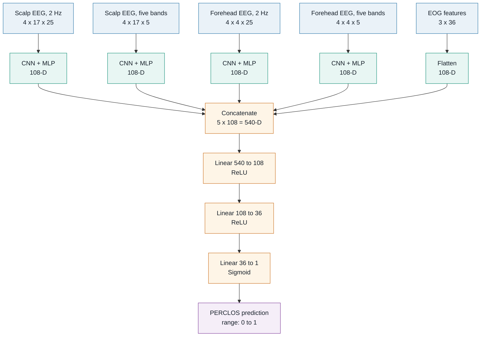

# SEED-VIG-CNN

**English** | [简体中文](README.zh-CN.md)

A driver-vigilance regression model for the Shanghai Jiao Tong University SEED-VIG dataset. The model fuses scalp EEG, forehead EEG, and EOG features to predict PERCLOS values between 0 and 1.

## Model



Every EEG input stacks PSD and DE features processed with moving average and LDS. Each EEG branch has its own `Conv2d(4, 8) -> Conv2d(8, 16) -> Conv2d(16, 4)` encoder, with batch normalization and ReLU after every convolution.

| Branch | Input | Projection after CNN |
| --- | ---: | --- |
| Scalp EEG, 2 Hz | `4 x 17 x 25` | `1700 -> 340 -> 80 -> 108` |
| Scalp EEG, five bands | `4 x 17 x 5` | `340 -> 80 -> 108` |
| Forehead EEG, 2 Hz | `4 x 4 x 25` | `400 -> 80 -> 108` |
| Forehead EEG, five bands | `4 x 4 x 5` | `80 -> 108` |
| EOG | `3 x 36` | Flatten directly to `108` |

Training minimizes mean squared error (MSE). The final sigmoid constrains the predicted PERCLOS value to the interval from 0 to 1.

## Setup

Install the base dependencies with [uv](https://docs.astral.sh/uv/):

```bash
uv sync
```

Install the optional Weights & Biases integration with:

```bash
uv sync --extra tracking
```

The dataset is available at <https://huggingface.co/datasets/dttutty/SEED-VIG>. Place its extracted feature folders under `SEED-VIG/`.

## Data conversion

Convert the MATLAB feature files into aligned Pickle arrays:

```bash
uv run mat_to_pickle.py --data-root SEED-VIG --output-dir data
```

This creates `inputs.pickle`, `outputs.pickle`, and `groups.pickle`. Incomplete records are skipped as a unit and described in `error_logs.txt`. The group metadata lets training split complete recording sessions instead of mixing samples from the same session across training and validation.

## Training

Train the full fusion model:

```bash
uv run train.py --data-dir data --epochs 300 --output model.pth
```

Select a subset of modalities when running an ablation:

```bash
uv run train.py --data-dir data --modalities eeg_2hz eog
```

Track the same training loop with W&B:

```bash
uv run --extra tracking train_with_wandb.py --data-dir data
```

The saved checkpoint contains the model state and the selected modality names.

Pretrained models from the original experiment are available on [Google Drive](https://drive.google.com/drive/folders/1BlhSXLg4RMnDUiPMFzWS9IkN8zUkZ3AR?usp=share_link).

## Tests

```bash
uv run pytest
```
