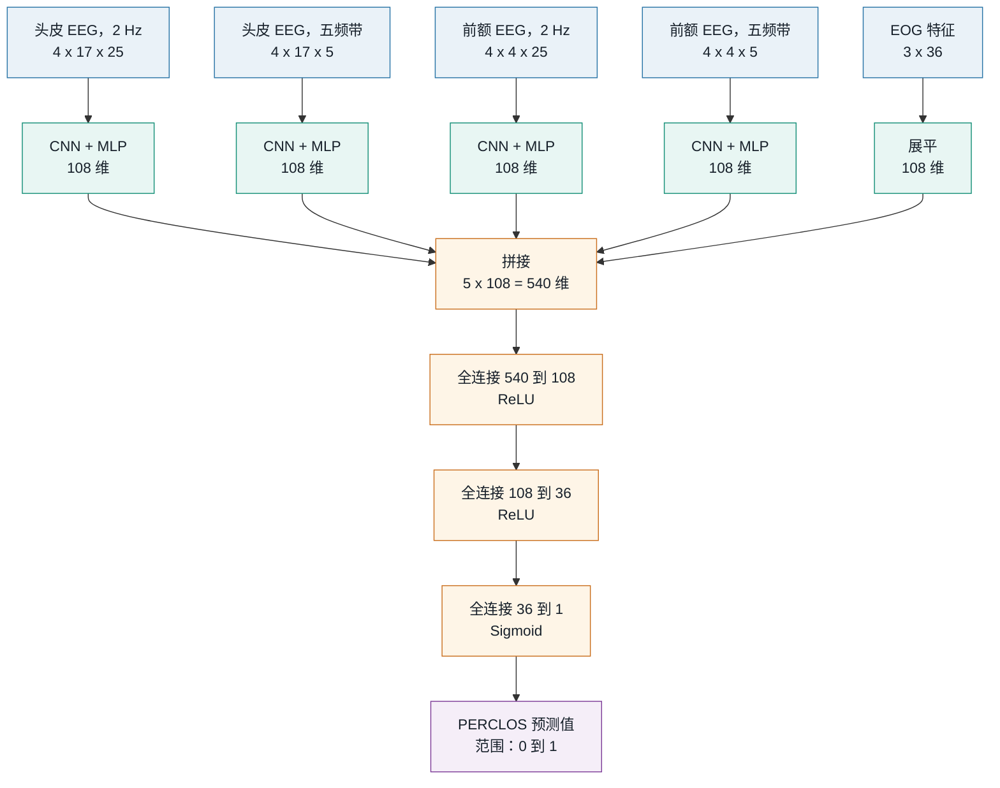

# SEED-VIG-CNN

[English](README.md) | **简体中文**

基于上海交通大学 SEED-VIG 数据集的驾驶警觉度回归模型。模型融合头皮 EEG、前额 EEG 和 EOG 特征，预测取值在 0 到 1 之间的 PERCLOS 指标。

## 模型架构



每组 EEG 输入由经过移动平均和 LDS 处理的 PSD、DE 特征堆叠而成。四个 EEG 分支分别拥有独立的 `Conv2d(4, 8) -> Conv2d(8, 16) -> Conv2d(16, 4)` 编码器，每层卷积之后均使用批归一化和 ReLU。

| 分支 | 输入尺寸 | CNN 后的投影层 |
| --- | ---: | --- |
| 头皮 EEG，2 Hz | `4 x 17 x 25` | `1700 -> 340 -> 80 -> 108` |
| 头皮 EEG，五频带 | `4 x 17 x 5` | `340 -> 80 -> 108` |
| 前额 EEG，2 Hz | `4 x 4 x 25` | `400 -> 80 -> 108` |
| 前额 EEG，五频带 | `4 x 4 x 5` | `80 -> 108` |
| EOG | `3 x 36` | 直接展平为 `108` 维 |

训练使用均方误差（MSE）作为损失函数。最终的 Sigmoid 将 PERCLOS 预测值限制在 0 到 1 之间。

## 环境安装

使用 [uv](https://docs.astral.sh/uv/) 安装基础依赖：

```bash
uv sync
```

如需使用 Weights & Biases 记录训练过程，请安装可选依赖：

```bash
uv sync --extra tracking
```

数据集可从 <https://huggingface.co/datasets/dttutty/SEED-VIG> 获取。解压后将特征目录放在 `SEED-VIG/` 下。

## 数据转换

将 MATLAB 特征文件转换为样本对齐的 Pickle 数组：

```bash
uv run mat_to_pickle.py --data-root SEED-VIG --output-dir data
```

该命令会生成 `inputs.pickle`、`outputs.pickle` 和 `groups.pickle`。不完整的记录会被整体跳过，并写入 `error_logs.txt`。训练时利用分组信息按完整记录划分训练集和验证集，避免同一记录的样本同时出现在两者中。

## 模型训练

训练完整的五路融合模型：

```bash
uv run train.py --data-dir data --epochs 300 --output model.pth
```

进行消融实验时可以只选择部分模态：

```bash
uv run train.py --data-dir data --modalities eeg_2hz eog
```

使用 W&B 记录相同的训练过程：

```bash
uv run --extra tracking train_with_wandb.py --data-dir data
```

保存的 checkpoint 包含模型状态和所选模态名称。

原始实验的预训练模型可从 [Google Drive](https://drive.google.com/drive/folders/1BlhSXLg4RMnDUiPMFzWS9IkN8zUkZ3AR?usp=share_link) 下载。

## 测试

```bash
uv run pytest
```
